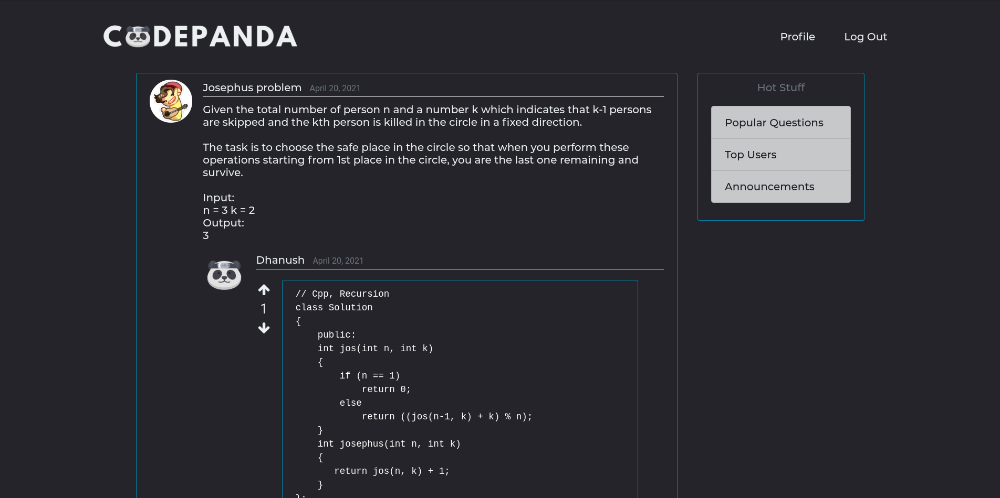

# :panda_face: CodePanda :panda_face:

A community oriented website where users can ask a question by  specifying the relevant tags, other users can contribute by posting their answer. 

## Installation
```
$ mkdir project
$ cd project
$ git clone https://github.com/BOISX4/CodePanda.git
```  

## Creating the Virtual Environment
```
$ python3 -m venv virtualenv
```
## Activating the Virual Environment
```
# Linux
$ source virtualenv/bin/activate

# Windows
$ virtualenv\Scripts\activate
```  

## Installing Requirements
```
$ pip install -r requirements.txt
```

## Running the Local Server
```
$ python manage.py runserver
```

## Setting up the Database
Make sure Postgresql is installed in your device
```
$ sudo su <USERNAME>
$ psql

# Inside psql shell
$ CREATE DATABASE CodePanda
$ CREATE USER <USERNAME> WITH PASSWORD 'password';
$ GRANT ALL PRIVILEGES ON DATABASE CodePanda TO <USERNAME>;
```


## Current User Interface



